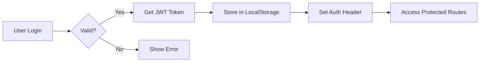

# 🌟 Web Admin - React Frontend

> Ứng dụng quản trị hiện đại được xây dựng với React 19, Vite, Tailwind CSS và CI/CD tự động với GitHub Actions

[](https://reactjs.org/)
[](https://vitejs.dev/)
[](https://tailwindcss.com/)
[](LICENSE)x

---

## � Mục lụczxx

- [Tính năng](#-tính-năng)
- [Yêu cầu hệ thống](#-yêu-cầu-hệ-thống)
- [Cài đặt dự án](#-cài-đặt-dự-án)
- [Cấu trúc dự án](#-cấu-trúc-dự-án)
- [Development](#-development)
- [Production Build](#-production-build)
- [Deployment](#-deployment)
- [API Integration](#-api-integration)
- [Components & Hooks](#-components--hooks)
- [Testing](#-testing)
- [Troubleshooting](#-troubleshooting)
- [Contributing](#-contributing)

---

## �🚀 Tính năng

### Core Features
- ✅ **React 19** - Phiên bản React mới nhất với hiệu năng tối ưu
- ✅ **Vite 6** - Build tool siêu nhanh, HMR instant
- ✅ **Tailwind CSS 4** - Utility-first CSS framework
- ✅ **React Router v7** - Client-side routing mạnh mẽ

### Advanced Features
- ✅ **Authentication System** - Đăng nhập/Đăng ký với JWT
- ✅ **Protected Routes** - Bảo vệ routes cần authentication
- ✅ **React Hook Form + Yup** - Form validation chuyên nghiệp
- ✅ **Custom Hooks** - useApi, useAuth, useForm, useDebounce
- ✅ **Axios Interceptors** - Tự động thêm token, xử lý lỗi
- ✅ **Responsive Design** - Hoạt động tốt trên mọi thiết bị
- ✅ **CI/CD Pipeline** - Tự động deploy với GitHub Actions
- ✅ **Nginx Configuration** - Production-ready server config

---

## � Yêu cầu hệ thống

### Development Environment
- **Node.js**: >= 18.0.0 (khuyến nghị 20.x LTS)
- **npm**: >= 9.0.0 hoặc **yarn**: >= 1.22.0
- **Git**: >= 2.30.0

### Production Server (Ubuntu)
- **Ubuntu**: 18.04+ (khuyến nghị 22.04 LTS)
- **Nginx**: >= 1.18
- **RAM**: Tối thiểu 512MB (khuyến nghị 1GB+)
- **Disk**: Tối thiểu 1GB free space
- **Network**: IP Public với port 80, 22 mở

### Kiểm tra phiên bản

```bash
# Kiểm tra Node.js
node --version

# Kiểm tra npm
npm --version

# Kiểm tra Git
git --version
```

---

## 🔧 Cài đặt dự án

### Bước 1: Clone Repository

```bash
# Clone qua HTTPS
git clone https://github.com/baoquoc29/web-admin-fe.git

# Hoặc clone qua SSH
git clone git@github.com:baoquoc29/web-admin-fe.git

# Di chuyển vào thư mục dự án
cd web-admin-fe
```

### Bước 2: Cài đặt Dependencies

```bash
# Sử dụng npm
npm install

# Hoặc sử dụng yarn
yarn install

# Hoặc sử dụng pnpm (nhanh hơn)
pnpm install
```

### Bước 3: Cấu hình Environment Variables

```bash
# Windows PowerShell
copy .env.example .env

# Linux/macOS
cp .env.example .env
```

Chỉnh sửa file `.env`:

```env
# API Configuration
VITE_API_BASE_URL=http://localhost:3000/api

# Environment
VITE_NODE_ENV=development
```

### Bước 4: Chạy Development Server

```bash
npm run dev
```

Ứng dụng sẽ chạy tại: **http://localhost:5173**

```
  VITE v6.0.6  ready in 324 ms

  ➜  Local:   http://localhost:5173/
  ➜  Network: use --host to expose
  ➜  press h + enter to show help
```

---

## �📁 Cấu trúc dự án

```
web-admin-fe/
├── .github/
│   └── workflows/
│       └── deploy.yml          # GitHub Actions CI/CD
├── public/                     # Static assets
├── src/
│   ├── api/                    # API configuration
│   │   ├── client.js          # Axios instance với interceptors
│   │   ├── config.js          # API endpoints constants
│   │   └── index.js           # Exported API services
│   ├── assets/                # Images, fonts, icons
│   ├── components/
│   │   ├── forms/             # Form components
│   │   │   ├── LoginForm.jsx
│   │   │   ├── RegisterForm.jsx
│   │   │   └── UserForm.jsx
│   │   ├── ui/                # Reusable UI components
│   │   │   ├── Button.jsx
│   │   │   ├── Input.jsx
│   │   │   ├── Card.jsx
│   │   │   ├── Modal.jsx
│   │   │   ├── Loading.jsx
│   │   │   └── Toast.jsx
│   │   └── Header.jsx         # App header
│   ├── hooks/                 # Custom React hooks
│   │   └── index.js          # useApi, useAuth, useForm, etc.
│   ├── layouts/               # Layout components
│   │   ├── MainLayout.jsx    # Main layout với header/footer
│   │   └── AuthLayout.jsx    # Layout cho login/register
│   ├── pages/                 # Page components (routes)
│   │   ├── HomePage.jsx
│   │   ├── DashboardPage.jsx
│   │   ├── LoginPage.jsx
│   │   ├── RegisterPage.jsx
│   │   ├── TasksPage.jsx
│   │   ├── URLsPage.jsx
│   │   ├── KeywordsPage.jsx
│   │   └── SchedulesPage.jsx
│   ├── services/              # Business logic
│   │   └── index.js          # authService, userService
│   ├── utils/                 # Utility functions
│   │   ├── constants.js      # App constants
│   │   ├── helpers.js        # Helper functions
│   │   └── validation.js     # Yup validation schemas
│   ├── App.jsx               # Main App với routing
│   ├── App.css               # App styles
│   ├── main.jsx              # Entry point
│   └── index.css             # Global styles
├── .env.example              # Environment variables template
├── .gitignore               # Git ignore rules
├── DEPLOYMENT.md            # Deployment guide chi tiết
├── QUICKSTART.md            # Quick start guide
├── eslint.config.js         # ESLint configuration
├── index.html               # HTML template
├── nginx.conf               # Nginx configuration
├── package.json             # Dependencies & scripts
├── postcss.config.js        # PostCSS configuration
├── README.md                # This file
├── server-setup.sh          # Server setup script
├── tailwind.config.js       # Tailwind CSS configuration
└── vite.config.js           # Vite configuration
```

---

## 🛠 Development

### Available Scripts

```bash
# Development server với HMR
npm run dev

# Build cho production
npm run build

# Preview production build locally
npm run preview

# Lint code với ESLint
npm run lint

# Format code (nếu có prettier)
npm run format
```

### Development Workflow

1. **Tạo component mới**
```bash
# Tạo file component
touch src/components/MyComponent.jsx
```

2. **Tạo page mới**
```bash
# Tạo file page
touch src/pages/MyPage.jsx

# Thêm route vào App.jsx
```

3. **Tạo custom hook**
```bash
# Thêm vào src/hooks/index.js
export const useMyHook = () => { /* logic */ }
```

4. **Hot Module Replacement (HMR)**
- Vite tự động reload khi bạn save file
- React components giữ nguyên state khi HMR
- CSS updates không reload page

### Code Style Guidelines

```jsx
// ✅ Good: Named exports cho components
export const Button = ({ children, onClick }) => {
  return <button onClick={onClick}>{children}</button>
}

// ✅ Good: Destructure props
const Input = ({ label, name, value, onChange }) => { }

// ✅ Good: Use constants
import { API_ENDPOINTS } from './utils/constants'

// ❌ Bad: Default exports (khó tree-shake)
export default Button

// ❌ Bad: Inline styles (dùng Tailwind)
<div style={{ color: 'red' }}>Bad</div>
```

### Environment Variables

Tất cả environment variables phải bắt đầu với `VITE_`:

```env
# ✅ Good
VITE_API_BASE_URL=http://localhost:3000/api
VITE_ENVIRONMENT=development

# ❌ Bad - sẽ không được expose
API_KEY=secret123
NODE_ENV=development
```

Sử dụng trong code:

```jsx
const apiUrl = import.meta.env.VITE_API_BASE_URL
const isDev = import.meta.env.DEV // Built-in Vite variable
```

---

## 🏗 Production Build

### Build Application

```bash
# Build cho production
npm run build

# Output sẽ ở thư mục dist/
```

Build output:

```
dist/
├── assets/
│   ├── index-[hash].js      # JavaScript bundle
│   ├── index-[hash].css     # CSS bundle
│   └── [images]             # Optimized images
└── index.html               # Entry HTML file
```

### Build Optimization

Vite tự động optimize:
- ✅ Code splitting
- ✅ Tree shaking
- ✅ Minification
- ✅ CSS extraction
- ✅ Asset optimization
- ✅ Compression

### Preview Production Build

```bash
# Preview locally
npm run preview

# Server sẽ chạy tại http://localhost:4173
```

### Build Statistics

Để xem chi tiết bundle size:

```bash
# Build với stats
npm run build -- --mode production

# Kiểm tra dist/ folder
ls -lh dist/assets/
```

---

## � Deployment

### 📦 Deployment Options

Dự án này hỗ trợ nhiều phương thức deployment:

1. **GitHub Actions CI/CD** (Recommended) ⭐
2. Manual deployment với SSH
3. Docker deployment
4. Vercel/Netlify (Static hosting)

### 🎯 GitHub Actions CI/CD (Recommended)

**Tự động deploy khi push code lên branch `master`**

#### Quick Setup (5 phút)

1. **Chuẩn bị Server Ubuntu**
```bash
ssh ubuntu@YOUR_SERVER_IP
sudo apt update && sudo apt install nginx -y
sudo mkdir -p /var/www/web-admin
```

2. **Tạo SSH Key**
```bash
# Trên máy local
ssh-keygen -t rsa -b 4096 -C "github-actions"

# Copy public key lên server
ssh-copy-id -i ~/.ssh/id_rsa.pub ubuntu@YOUR_SERVER_IP
```

3. **Cấu hình GitHub Secrets**

Vào: `GitHub Repository → Settings → Secrets → Actions`

Thêm 5 secrets:
- `SERVER_HOST`: IP public server (VD: 103.123.456.789)
- `SERVER_USERNAME`: ubuntu
- `SERVER_PORT`: 22
- `SSH_PRIVATE_KEY`: Private key (toàn bộ nội dung)
- `VITE_API_BASE_URL`: http://YOUR_IP:3000/api

4. **Cấu hình Nginx**
```bash
# Copy nginx.conf từ project
sudo nano /etc/nginx/sites-available/web-admin
# Paste nội dung và thay YOUR_SERVER_IP

# Enable site
sudo ln -s /etc/nginx/sites-available/web-admin /etc/nginx/sites-enabled/
sudo nginx -t && sudo systemctl reload nginx
```

5. **Deploy**
```bash
git add .
git commit -m "Deploy to production"
git push origin master
```

✅ **Xong!** GitHub Actions sẽ tự động:
- Build application
- Deploy lên server qua SSH
- Backup version cũ
- Reload Nginx

**Xem chi tiết**: [DEPLOYMENT.md](DEPLOYMENT.md) | [QUICKSTART.md](QUICKSTART.md)

### 🐳 Docker Deployment

```dockerfile
# Dockerfile
FROM node:20-alpine as build
WORKDIR /app
COPY package*.json ./
RUN npm ci
COPY . .
RUN npm run build

FROM nginx:alpine
COPY --from=build /app/dist /usr/share/nginx/html
COPY nginx.conf /etc/nginx/conf.d/default.conf
EXPOSE 80
CMD ["nginx", "-g", "daemon off;"]
```

```bash
# Build và run
docker build -t web-admin .
docker run -p 80:80 web-admin
```

### ☁️ Vercel/Netlify Deployment

```bash
# Vercel
npm i -g vercel
vercel

# Netlify
npm i -g netlify-cli
netlify deploy --prod
```

---

## 🔧 API Integration

### Axios Client Configuration

File: `src/api/client.js`

```javascript
import axios from 'axios'

// Tạo axios instance
const apiClient = axios.create({
  baseURL: import.meta.env.VITE_API_BASE_URL,
  timeout: 10000,
  headers: {
    'Content-Type': 'application/json'
  }
})

// Request interceptor - Thêm token
apiClient.interceptors.request.use(
  (config) => {
    const token = localStorage.getItem('token')
    if (token) {
      config.headers.Authorization = `Bearer ${token}`
    }
    return config
  },
  (error) => Promise.reject(error)
)

// Response interceptor - Xử lý lỗi global
apiClient.interceptors.response.use(
  (response) => response.data,
  (error) => {
    if (error.response?.status === 401) {
      // Redirect to login
      localStorage.removeItem('token')
      window.location.href = '/login'
    }
    return Promise.reject(error)
  }
)

export default apiClient
```

### API Services

File: `src/services/index.js`

```javascript
import apiClient from '../api/client'

// Auth Service
export const authService = {
  login: (credentials) => 
    apiClient.post('/auth/login', credentials),
  
  register: (userData) => 
    apiClient.post('/auth/register', userData),
  
  logout: () => 
    apiClient.post('/auth/logout'),
  
  getProfile: () => 
    apiClient.get('/auth/profile')
}

// User Service
export const userService = {
  getAll: () => apiClient.get('/users'),
  getById: (id) => apiClient.get(`/users/${id}`),
  create: (data) => apiClient.post('/users', data),
  update: (id, data) => apiClient.put(`/users/${id}`, data),
  delete: (id) => apiClient.delete(`/users/${id}`)
}
```

### Custom Hooks

File: `src/hooks/index.js`

#### useApi Hook
```javascript
import { useState, useCallback } from 'react'

export const useApi = (apiFunc) => {
  const [data, setData] = useState(null)
  const [loading, setLoading] = useState(false)
  const [error, setError] = useState(null)

  const execute = useCallback(async (...args) => {
    try {
      setLoading(true)
      setError(null)
      const response = await apiFunc(...args)
      setData(response)
      return { success: true, data: response }
    } catch (err) {
      setError(err.message)
      return { success: false, error: err }
    } finally {
      setLoading(false)
    }
  }, [apiFunc])

  return { data, loading, error, execute }
}
```

#### useAuth Hook
```javascript
export const useAuth = () => {
  const [user, setUser] = useState(null)
  const [isAuthenticated, setIsAuthenticated] = useState(false)

  const login = async (credentials) => {
    const result = await authService.login(credentials)
    if (result.success) {
      localStorage.setItem('token', result.data.token)
      setUser(result.data.user)
      setIsAuthenticated(true)
    }
    return result
  }

  const logout = () => {
    localStorage.removeItem('token')
    setUser(null)
    setIsAuthenticated(false)
  }

  return { user, isAuthenticated, login, logout }
}
```

#### useDebounce Hook
```javascript
import { useState, useEffect } from 'react'

export const useDebounce = (value, delay = 500) => {
  const [debouncedValue, setDebouncedValue] = useState(value)

  useEffect(() => {
    const timer = setTimeout(() => {
      setDebouncedValue(value)
    }, delay)

    return () => clearTimeout(timer)
  }, [value, delay])

  return debouncedValue
}
```

### Sử dụng API trong Components

```jsx
import { useApi } from './hooks'
import { userService } from './services'

function UsersPage() {
  const { data: users, loading, execute: fetchUsers } = useApi(userService.getAll)

  useEffect(() => {
    fetchUsers()
  }, [])

  if (loading) return <Loading />

  return (
    <div>
      {users?.map(user => (
        <UserCard key={user.id} user={user} />
      ))}
    </div>
  )
}
```

---

## 🎨 Components & Hooks

### UI Components

#### Button Component
```jsx
import { Button } from './components/ui'

// Variants: primary, secondary, danger, success
<Button variant="primary" size="lg" onClick={handleClick}>
  Click Me
</Button>

// With loading state
<Button variant="primary" loading={isLoading}>
  {isLoading ? 'Loading...' : 'Submit'}
</Button>

// Disabled
<Button variant="secondary" disabled>
  Disabled
</Button>
```

#### Input Component
```jsx
import { Input } from './components/ui'

<Input
  label="Email Address"
  name="email"
  type="email"
  value={email}
  onChange={(e) => setEmail(e.target.value)}
  error={errors.email}
  placeholder="Enter your email"
  required
/>
```

#### Card Component
```jsx
import { Card } from './components/ui'

<Card 
  title="User Information"
  subtitle="Manage user details"
>
  <p>Card content here</p>
</Card>
```

#### Modal Component
```jsx
import { Modal } from './components/ui'

const [isOpen, setIsOpen] = useState(false)

<Modal
  isOpen={isOpen}
  onClose={() => setIsOpen(false)}
  title="Confirm Action"
>
  <p>Are you sure?</p>
  <Button onClick={handleConfirm}>Yes</Button>
</Modal>
```

#### Loading Component
```jsx
import { Loading } from './components/ui'

// Full page loading
{isLoading && <Loading />}

// Inline loading
<Loading size="sm" />
```

#### Toast Notifications
```jsx
import { Toast, ToastContainer } from './components/ui'

<ToastContainer />

// Show toast
toast.success('Operation successful!')
toast.error('Something went wrong')
toast.info('Information message')
```

### Form Components

#### LoginForm
```jsx
import { LoginForm } from './components/forms'

<LoginForm 
  onSuccess={(data) => {
    console.log('Login successful:', data)
    navigate('/dashboard')
  }}
  onError={(error) => {
    console.error('Login failed:', error)
  }}
/>
```

#### RegisterForm
```jsx
import { RegisterForm } from './components/forms'

<RegisterForm 
  onSuccess={(data) => {
    console.log('Registration successful:', data)
    navigate('/login')
  }}
/>
```

#### UserForm (Create/Edit)
```jsx
import { UserForm } from './components/forms'

// Create new user
<UserForm 
  user={null}
  onSuccess={(data) => {
    console.log('User created:', data)
    fetchUsers()
  }}
  onCancel={() => setShowForm(false)}
/>

// Edit existing user
<UserForm 
  user={selectedUser}
  onSuccess={(data) => {
    console.log('User updated:', data)
    fetchUsers()
  }}
  onCancel={() => setShowForm(false)}
/>
```

### Form Validation với Yup

File: `src/utils/validation.js`

```javascript
import * as yup from 'yup'

export const loginSchema = yup.object({
  email: yup
    .string()
    .email('Email không hợp lệ')
    .required('Email là bắt buộc'),
  password: yup
    .string()
    .min(6, 'Mật khẩu phải có ít nhất 6 ký tự')
    .required('Mật khẩu là bắt buộc')
})

export const registerSchema = yup.object({
  name: yup.string().required('Tên là bắt buộc'),
  email: yup.string().email().required('Email là bắt buộc'),
  password: yup.string().min(6).required('Mật khẩu là bắt buộc'),
  confirmPassword: yup
    .string()
    .oneOf([yup.ref('password')], 'Mật khẩu không khớp')
    .required('Xác nhận mật khẩu là bắt buộc')
})
```

### Custom Hooks Summary

| Hook | Purpose | Example |
|------|---------|---------|
| `useApi` | API calls với loading/error states | `const { data, loading, execute } = useApi(apiFunc)` |
| `useAuth` | Authentication logic | `const { user, login, logout } = useAuth()` |
| `useForm` | Form handling | `const { values, errors, handleChange } = useForm()` |
| `useDebounce` | Debounce values | `const debouncedSearch = useDebounce(search, 500)` |
| `useLocalStorage` | LocalStorage state | `const [value, setValue] = useLocalStorage('key')` |

---

## 🔐 Authentication & Authorization

### Authentication Flow



### Protected Routes

File: `src/App.jsx`

```jsx
import { BrowserRouter, Routes, Route, Navigate } from 'react-router-dom'
import { useAuth } from './hooks'

// Protected Route Component
const ProtectedRoute = ({ children }) => {
  const { isAuthenticated } = useAuth()
  
  if (!isAuthenticated) {
    return <Navigate to="/login" replace />
  }
  
  return children
}

// Public Route Component (redirect if authenticated)
const PublicRoute = ({ children }) => {
  const { isAuthenticated } = useAuth()
  
  if (isAuthenticated) {
    return <Navigate to="/dashboard" replace />
  }
  
  return children
}

function App() {
  return (
    <BrowserRouter>
      <Routes>
        {/* Public Routes */}
        <Route path="/login" element={
          <PublicRoute>
            <LoginPage />
          </PublicRoute>
        } />
        
        <Route path="/register" element={
          <PublicRoute>
            <RegisterPage />
          </PublicRoute>
        } />
        
        {/* Protected Routes */}
        <Route path="/dashboard" element={
          <ProtectedRoute>
            <MainLayout>
              <DashboardPage />
            </MainLayout>
          </ProtectedRoute>
        } />
        
        <Route path="/tasks" element={
          <ProtectedRoute>
            <MainLayout>
              <TasksPage />
            </MainLayout>
          </ProtectedRoute>
        } />
        
        {/* Default Route */}
        <Route path="/" element={<Navigate to="/dashboard" replace />} />
        <Route path="*" element={<NotFoundPage />} />
      </Routes>
    </BrowserRouter>
  )
}
```

### Using Authentication

```jsx
import { useAuth } from './hooks'

function MyComponent() {
  const { user, login, logout, isAuthenticated, loading } = useAuth()

  const handleLogin = async (credentials) => {
    const result = await login(credentials)
    
    if (result.success) {
      toast.success('Đăng nhập thành công!')
      navigate('/dashboard')
    } else {
      toast.error(result.error)
    }
  }

  const handleLogout = () => {
    logout()
    navigate('/login')
  }

  if (loading) return <Loading />

  return (
    <div>
      {isAuthenticated ? (
        <>
          <p>Xin chào, {user.name}!</p>
          <Button onClick={handleLogout}>Đăng xuất</Button>
        </>
      ) : (
        <p>Vui lòng đăng nhập</p>
      )}
    </div>
  )
}
```

### Token Management

```javascript
// Lưu token sau khi login
localStorage.setItem('token', data.token)

// Lấy token để gọi API
const token = localStorage.getItem('token')

// Xóa token khi logout
localStorage.removeItem('token')

// Kiểm tra token hết hạn
const isTokenExpired = (token) => {
  const payload = JSON.parse(atob(token.split('.')[1]))
  return payload.exp < Date.now() / 1000
}
```

---

## 🎨 Styling với Tailwind CSS

### Tailwind Configuration

File: `tailwind.config.js`

```javascript
export default {
  content: [
    "./index.html",
    "./src/**/*.{js,ts,jsx,tsx}",
  ],
  theme: {
    extend: {
      colors: {
        primary: '#3b82f6',
        secondary: '#64748b',
        danger: '#ef4444',
        success: '#10b981',
      }
    },
  },
  plugins: [
    require('@tailwindcss/forms'),
  ],
}
```

### Custom Classes

File: `src/index.css`

```css
@tailwind base;
@tailwind components;
@tailwind utilities;

@layer components {
  /* Button Classes */
  .btn {
    @apply px-4 py-2 rounded-lg font-medium transition-all;
  }
  
  .btn-primary {
    @apply bg-blue-600 text-white hover:bg-blue-700;
  }
  
  .btn-secondary {
    @apply bg-gray-200 text-gray-800 hover:bg-gray-300;
  }
  
  /* Form Classes */
  .form-group {
    @apply mb-4;
  }
  
  .form-label {
    @apply block text-sm font-medium text-gray-700 mb-2;
  }
  
  .input-field {
    @apply w-full px-4 py-2 border border-gray-300 rounded-lg
           focus:ring-2 focus:ring-blue-500 focus:border-transparent;
  }
  
  .form-error {
    @apply text-red-500 text-sm mt-1;
  }
}
```

### Responsive Design Examples

```jsx
// Grid Layout
<div className="grid grid-cols-1 md:grid-cols-2 lg:grid-cols-3 gap-4">
  <div>Column 1</div>
  <div>Column 2</div>
  <div>Column 3</div>
</div>

// Flex Layout
<div className="flex flex-col md:flex-row gap-4">
  <div className="flex-1">Left</div>
  <div className="flex-1">Right</div>
</div>

// Typography
<h1 className="text-2xl md:text-3xl lg:text-4xl font-bold">
  Responsive Heading
</h1>

// Spacing
<div className="p-4 md:p-6 lg:p-8">
  Responsive padding
</div>

// Visibility
<div className="hidden md:block">
  Visible only on medium screens and up
</div>
```

### Tailwind Breakpoints

| Breakpoint | Min Width | Example |
|------------|-----------|---------|
| `sm` | 640px | `sm:text-lg` |
| `md` | 768px | `md:grid-cols-2` |
| `lg` | 1024px | `lg:px-8` |
| `xl` | 1280px | `xl:max-w-7xl` |
| `2xl` | 1536px | `2xl:text-6xl` |

---

## 📡 API Endpoints Reference

### Base URL

```
Development: http://localhost:3000/api
Production: http://YOUR_SERVER_IP:3000/api
```

### Authentication Endpoints

| Method | Endpoint | Description | Auth Required |
|--------|----------|-------------|---------------|
| POST | `/auth/login` | Đăng nhập | ❌ |
| POST | `/auth/register` | Đăng ký tài khoản mới | ❌ |
| POST | `/auth/logout` | Đăng xuất | ✅ |
| GET | `/auth/profile` | Lấy thông tin user hiện tại | ✅ |
| PUT | `/auth/profile` | Cập nhật profile | ✅ |
| POST | `/auth/refresh` | Refresh token | ✅ |

### Users Management

| Method | Endpoint | Description | Auth Required |
|--------|----------|-------------|---------------|
| GET | `/users` | Lấy danh sách users | ✅ |
| GET | `/users/:id` | Lấy thông tin user | ✅ |
| POST | `/users` | Tạo user mới | ✅ |
| PUT | `/users/:id` | Cập nhật user | ✅ |
| DELETE | `/users/:id` | Xóa user | ✅ |

### Tasks Management

| Method | Endpoint | Description | Auth Required |
|--------|----------|-------------|---------------|
| GET | `/tasks` | Lấy danh sách tasks | ✅ |
| GET | `/tasks/:id` | Lấy chi tiết task | ✅ |
| POST | `/tasks` | Tạo task mới | ✅ |
| PUT | `/tasks/:id` | Cập nhật task | ✅ |
| DELETE | `/tasks/:id` | Xóa task | ✅ |

### Example API Calls

```javascript
// Login
const response = await authService.login({
  email: 'user@example.com',
  password: 'password123'
})

// Get users with pagination
const users = await userService.getAll({
  page: 1,
  limit: 10,
  search: 'john'
})

// Create task
const task = await taskService.create({
  title: 'New Task',
  description: 'Task description',
  status: 'pending'
})
```

---

## 🧪 Testing

### Unit Testing (Coming Soon)

```bash
# Install testing dependencies
npm install -D vitest @testing-library/react @testing-library/jest-dom

# Run tests
npm run test

# Run tests in watch mode
npm run test:watch

# Generate coverage report
npm run test:coverage
```

### Test Example

```javascript
import { render, screen } from '@testing-library/react'
import { Button } from './components/ui/Button'

describe('Button Component', () => {
  it('renders button with text', () => {
    render(<Button>Click Me</Button>)
    expect(screen.getByText('Click Me')).toBeInTheDocument()
  })

  it('handles click events', () => {
    const handleClick = vi.fn()
    render(<Button onClick={handleClick}>Click Me</Button>)
    screen.getByText('Click Me').click()
    expect(handleClick).toHaveBeenCalledOnce()
  })
})
```

### E2E Testing với Playwright (Coming Soon)

```bash
npm install -D @playwright/test
npx playwright install

# Run E2E tests
npm run test:e2e
```

---

## � Troubleshooting

### Common Issues

#### 1. Port already in use

```bash
# Error: Port 5173 is already in use

# Solution: Kill process or use different port
# Windows
netstat -ano | findstr :5173
taskkill /PID <PID> /F

# Linux/macOS
lsof -ti:5173 | xargs kill -9

# Or use different port
npm run dev -- --port 3000
```

#### 2. Module not found errors

```bash
# Error: Cannot find module 'xyz'

# Solution: Clear cache and reinstall
rm -rf node_modules package-lock.json
npm install
```

#### 3. Build fails

```bash
# Error: Build failed

# Solution: Check for syntax errors
npm run lint

# Clear Vite cache
rm -rf node_modules/.vite

# Rebuild
npm run build
```

#### 4. API connection errors

```bash
# Error: Network Error / ERR_CONNECTION_REFUSED

# Check .env file
cat .env

# Verify backend is running
curl http://localhost:3000/api/health

# Check CORS settings on backend
```

#### 5. Deployment fails on GitHub Actions

```bash
# Check GitHub Actions logs
# Verify all secrets are set correctly
# Test SSH connection manually:
ssh -i ~/.ssh/github_actions_key ubuntu@YOUR_SERVER_IP
```

#### 6. Nginx 502 Bad Gateway

```bash
# Check Nginx error logs
sudo tail -f /var/log/nginx/error.log

# Verify files exist
ls -la /var/www/web-admin

# Check Nginx config
sudo nginx -t

# Restart Nginx
sudo systemctl restart nginx
```

### Debug Mode

```bash
# Enable verbose logging
VITE_DEBUG=true npm run dev

# Check Vite logs
DEBUG=vite:* npm run dev
```

### Performance Issues

```bash
# Analyze bundle size
npm run build
npx vite-bundle-visualizer

# Check for large dependencies
npm ls --depth=0 --long
```

---

## 📦 Dependencies

### Production Dependencies

| Package | Version | Purpose |
|---------|---------|---------|
| `react` | ^19.1.1 | UI library |
| `react-dom` | ^19.1.1 | React DOM renderer |
| `react-router-dom` | ^7.9.3 | Client-side routing |
| `axios` | ^1.12.2 | HTTP client |
| `react-hook-form` | ^7.63.0 | Form handling |
| `@hookform/resolvers` | ^5.2.2 | Form validation resolvers |
| `yup` | ^1.7.1 | Schema validation |

### Development Dependencies

| Package | Version | Purpose |
|---------|---------|---------|
| `vite` | ^6.0.6 | Build tool |
| `@vitejs/plugin-react` | ^4.3.4 | React plugin for Vite |
| `tailwindcss` | ^4.1.14 | CSS framework |
| `@tailwindcss/forms` | ^0.5.10 | Form styling |
| `@tailwindcss/postcss` | ^4.1.14 | PostCSS plugin |
| `postcss` | ^8.5.6 | CSS processor |
| `autoprefixer` | ^10.4.21 | CSS autoprefixer |
| `eslint` | ^9.36.0 | Code linter |
| `eslint-plugin-react-hooks` | ^5.2.0 | React hooks linting |

### Update Dependencies

```bash
# Check for updates
npm outdated

# Update all dependencies
npm update

# Update specific package
npm install package-name@latest

# Update to latest major versions (careful!)
npx npm-check-updates -u
npm install
```

---

## 🤝 Contributing

Chúng tôi rất hoan nghênh các đóng góp từ cộng đồng! 

### Quy trình đóng góp

1. **Fork repository**
```bash
# Click nút Fork trên GitHub
# Clone fork về máy
git clone https://github.com/YOUR_USERNAME/web-admin-fe.git
```

2. **Tạo branch mới**
```bash
git checkout -b feature/amazing-feature
# Hoặc
git checkout -b fix/bug-fix
```

3. **Commit changes**
```bash
git add .
git commit -m "feat: add amazing feature"

# Commit message format:
# feat: new feature
# fix: bug fix
# docs: documentation
# style: formatting
# refactor: code refactoring
# test: adding tests
# chore: maintenance
```

4. **Push changes**
```bash
git push origin feature/amazing-feature
```

5. **Tạo Pull Request**
- Vào GitHub repository
- Click "New Pull Request"
- Describe changes
- Submit PR

### Code Style Guidelines

- Sử dụng ES6+ syntax
- Follow ESLint rules
- Use Tailwind CSS (không inline styles)
- Tên component: PascalCase
- Tên file: PascalCase.jsx
- Tên function: camelCase
- Thêm comments cho logic phức tạp

### Commit Message Convention

```bash
# Format
<type>(<scope>): <subject>

# Examples
feat(auth): add login functionality
fix(ui): resolve button styling issue
docs(readme): update installation guide
refactor(api): improve error handling
```

---

## 📚 Additional Resources

### Documentation
- [React Documentation](https://react.dev)
- [Vite Documentation](https://vitejs.dev)
- [Tailwind CSS Documentation](https://tailwindcss.com)
- [React Router Documentation](https://reactrouter.com)
- [Axios Documentation](https://axios-http.com)

### Tutorials
- [React Hook Form Guide](https://react-hook-form.com)
- [Yup Validation Schema](https://github.com/jquense/yup)
- [GitHub Actions CI/CD](https://docs.github.com/en/actions)

### Tools
- [VS Code](https://code.visualstudio.com) - Recommended IDE
- [React Developer Tools](https://react.dev/learn/react-developer-tools)
- [Tailwind CSS IntelliSense](https://marketplace.visualstudio.com/items?itemName=bradlc.vscode-tailwindcss)

---

## 📞 Support & Contact

### Need Help?

- 📖 Check [DEPLOYMENT.md](DEPLOYMENT.md) for deployment guide
- 🚀 Check [QUICKSTART.md](QUICKSTART.md) for quick setup
- 🐛 Found a bug? [Open an issue](https://github.com/baoquoc29/web-admin-fe/issues)
- 💡 Feature request? [Open a discussion](https://github.com/baoquoc29/web-admin-fe/discussions)

### Repository

- **GitHub**: [baoquoc29/web-admin-fe](https://github.com/baoquoc29/web-admin-fe)
- **Issues**: [Report bugs](https://github.com/baoquoc29/web-admin-fe/issues)
- **Pull Requests**: [Contribute](https://github.com/baoquoc29/web-admin-fe/pulls)

---

## 📄 License

This project is licensed under the **MIT License**.

```
MIT License

Copyright (c) 2025 Web Admin

Permission is hereby granted, free of charge, to any person obtaining a copy
of this software and associated documentation files (the "Software"), to deal
in the Software without restriction, including without limitation the rights
to use, copy, modify, merge, publish, distribute, sublicense, and/or sell
copies of the Software, and to permit persons to whom the Software is
furnished to do so, subject to the following conditions:

The above copyright notice and this permission notice shall be included in all
copies or substantial portions of the Software.

THE SOFTWARE IS PROVIDED "AS IS", WITHOUT WARRANTY OF ANY KIND, EXPRESS OR
IMPLIED, INCLUDING BUT NOT LIMITED TO THE WARRANTIES OF MERCHANTABILITY,
FITNESS FOR A PARTICULAR PURPOSE AND NONINFRINGEMENT. IN NO EVENT SHALL THE
AUTHORS OR COPYRIGHT HOLDERS BE LIABLE FOR ANY CLAIM, DAMAGES OR OTHER
LIABILITY, WHETHER IN AN ACTION OF CONTRACT, TORT OR OTHERWISE, ARISING FROM,
OUT OF OR IN CONNECTION WITH THE SOFTWARE OR THE USE OR OTHER DEALINGS IN THE
SOFTWARE.
```

---

## 🎉 Acknowledgments

- [React Team](https://react.dev/community/team) - For the amazing React library
- [Vite Team](https://vitejs.dev/team) - For the blazing fast build tool
- [Tailwind Labs](https://tailwindcss.com) - For the awesome CSS framework
- All contributors who helped improve this project

---

## 🚀 Quick Links

| Link | Description |
|------|-------------|
| [Live Demo](#) | View live application |
| [API Documentation](#) | Backend API docs |
| [Deployment Guide](DEPLOYMENT.md) | Full deployment guide |
| [Quick Start](QUICKSTART.md) | Get started quickly |
| [Report Bug](https://github.com/baoquoc29/web-admin-fe/issues) | Report bugs |
| [Request Feature](https://github.com/baoquoc29/web-admin-fe/issues) | Request features |

---

<div align="center">

**Made with ❤️ by the Web Admin Team**

⭐ Star this repo if you find it helpful!

</div>
# fe-web-admin
